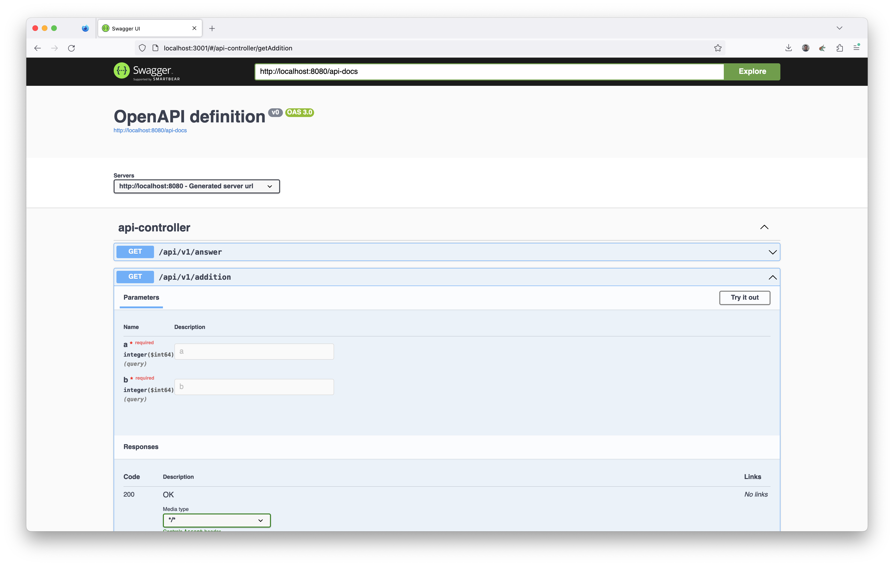

# Playground

This is a simple project to demonstrate usage of:
  - Java 21 (LTS) and Spring Boot
  - TypeScript and React (single-page application)


# Getting Started

The API is a project generated on https://start.spring.io/ with some other dependencies added on a ad-hoc basis.

``` zsh
mvn spring-boot:run
mvn spring-boot:start
mvn spring-boot:stop
```

I try to use Bun, currently at version 1.0.3 (so quite fresh, expect some rough edges). From the doc:

> Bun is an all-in-one toolkit for JavaScript and TypeScript apps. It ships as a single executable called `bun​`.
>
> At its core is the Bun runtime, a fast JavaScript runtime designed as a drop-in replacement for Node.js. It's written in Zig and powered by JavaScriptCore under the hood, dramatically reducing startup times and memory usage.

I followed:
- https://bun.sh/docs/typescript
- https://create-react-app.dev/docs/adding-typescript

and generated this project with:

``` zsh
bun create react-app client --template typescript
bun add -d bun-types
```

Start the frontend project with:

``` zsh
bun start
```

While very promising, it's not yet clear how to handle `index.html` in Bun. Because of that, I default on Node to build a deployable bundle:

``` zsh
node run build
```

Then the bundle can be served locally, as if it were from a CloudFront distribution:

``` zsh
bunx serve build
```

# Docker dependency services

Clean local Docker environments:

``` zsh
echo y | docker rm --force $(docker ps --all --quiet --filter status=exited)
echo y | docker volume prune
```

Start Docker environment containing local services:

``` zsh
docker compose up
# or, alternatively:
docker compose up --force-recreate --renew-anon-volumes
```

See [docker-compose.yml](./docker-compose.yml) for all services.

Now on your machine different services are available:

- Swagger UI: http://localhost:3001
- Grafana: http://localhost:3002
- Prometheus: http://localhost:9090



Grafana dashboards:
- https://grafana.com/grafana/dashboards/6756-spring-boot-statistics/
- Ideally there would be a standard dashboard for endpoints and another for database connections.


# Observability

We use Spring Boot actuator to gather several metrics. It is exposed here: http://localhost:8080/actuator, scraped by Prometheus and exposed to Grafana as « local » datasource.

# Load Simulation

A load simulation is described using the Java DSL. You can run it with Gatling:

``` zsh
mvn gatling:test
```

Of course it doesn't have a lot of meaning to run such simulation a local computer with a lot of different possible perturbation. An isolated, network-optimised environment in AWS is more repeatable. Still, it can give a rough, uneducated hint at the performance. Keep in mind that your local machine may have a limitation on the number of open file descriptors (`ulimit`), which further degrades the ability to simulate high load.


A note on AWS resources: instances should be in the same availability zone (ha ha), and Elastic Fabric Adapter network interface should help make the CPU and memory the limiting factors, not the network IO.

# Latency graphs

Using https://github.com/giltene/wrk2:

``` zsh
wrk --threads 2 --connections 10 --duration 45s --rate 3000 --latency http://localhost:8080/api/v1/addition\?a\=1\&b\=2 | wrk2img result-$(gdate +"%Y-%m-%dT%H:%M:%S.%3N").png
```


The API operation under test is so simple and pure (a mathematical addition) that this graph doesn't really test anything except the Spring Boot framework itself running on a local machine.

# Reference Documentation

For further reference, please consider the following sections:

* [Official Apache Maven documentation](https://maven.apache.org/guides/index.html)
* [Spring Boot Maven Plugin Reference Guide](https://docs.spring.io/spring-boot/docs/3.1.4/maven-plugin/reference/html/)
* [Create an OCI image](https://docs.spring.io/spring-boot/docs/3.1.4/maven-plugin/reference/html/#build-image)
* [Spring Web](https://docs.spring.io/spring-boot/docs/3.1.4/reference/htmlsingle/index.html#web)

### Guides
The following guides illustrate how to use some features concretely:

* [Building a RESTful Web Service](https://spring.io/guides/gs/rest-service/)
* [Serving Web Content with Spring MVC](https://spring.io/guides/gs/serving-web-content/)
* [Building REST services with Spring](https://spring.io/guides/tutorials/rest/)

